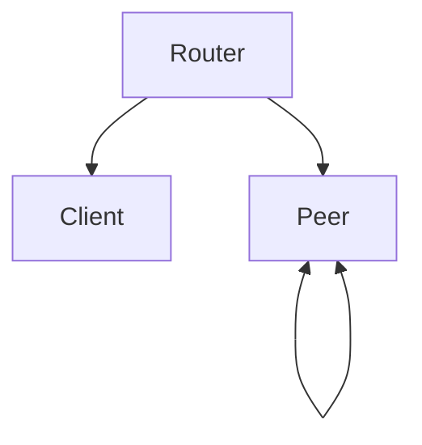

# 架构总览

Zenoh 有三种节点模式，选型取决于是否需要路由能力与可用性。

> **[建议]** 边缘原型用 peer 模式；跨网段或需要稳定路由时用 router 模式。

## 三种节点模式

图：三种节点模式的关系

| 模式 | 角色 | 典型场景 |
|------|------|----------|
| router | 路由、发现 | 云端汇聚、跨网段 |
| peer | 对等成员 | 边缘集群、低延迟 |
| client | 轻量端点 | 受限设备、一次性连接 |

> **[警告]** client 模式不参与路由，断开 router 后无法与其他节点通信。
