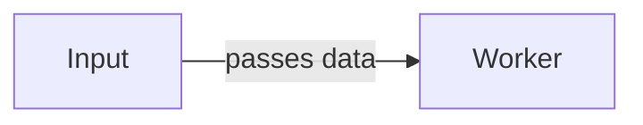

# Markdown 作者约定（务实子集）

> **MD 是信息主源**，HTML 由 `scripts/build_html.py` 渲染。
> 本文件规定 agent 写 MD 时的约定——通用/GitHub 方言，GitHub 上可直接阅读，
> builder 识别后升级为"静奢"HTML 富组件（务实子集）。

## 源目录结构

```
{RUN}/src/
├── book.yml          元数据（见下）
├── README.md         （可选）MD 版目录；缺失则 builder 自动生成
└── NN_*.md           章节，编号 >= 02（00/01 留给封面/目录）
```

运行：`python scripts/build_html.py {RUN}/src {RUN}/output`
产出：`{RUN}/output/*.html`（HTML 版）+ `{RUN}/output-md/*.md`（可移植 MD 版）+ `diagrams/*.png`。

## book.yml（扁平 key: value，无需 YAML 库）

```
title: 书名
subtitle: English Subtitle
subtitle_cn: 中文副标题
author: 作者
edition: 中文版
lang: zh-CN
```

## 章节结构

每章以 `# 标题` 开头（builder 提取为 chapter-header，正文从 `##` 起）：

```markdown
# 第一章 导论

正文段落……

## 第一节
...
```

**标题深度 → 视觉层级**（builder 按实际标题深度自适应渲染，选适合内容的深度即可）：
- `##` → `####`：扁平型（概念/介绍为主），`####` 渲染为药丸标签
- `##` → `###` → `####`：标准型（多数技术书），`###` 为卡片式分组
- `##` → `###` → `####` → `#####`：深度型（复杂架构），`#####` 为大写微标签

## 组件约定（务实子集）

### 侧边栏 / callout —— 标签化引用块
首行 `> **[标签]** 内容`，后续 `> ` 行为正文（支持内联 MD）：

```markdown
> **[性能提示]** Zenoh 线上开销仅 4-6 字节。

> **[警告]** client 模式断开 router 后无法与其他节点通信。
```

标签 → CSS 变体（builder 自动映射，词表见下）：

| 标签 | 变体 |
|------|------|
| 性能提示 / performance | performance-tip |
| 警告 / 注意 / gotcha | gotcha-alert |
| 学习目标 / learn | learn |
| 检查清单 / check | check |
| 要点回顾 / 记住 | things-to-remember |
| 建议 / advice | author-advice |
| 理论说明 | theory-note |
| 注 / note | pedantic-note |
| 快速入门 | quick-start |
| 错误速查 | error-cheatsheet |
| 其它任意标签 | sidebar（默认） |

### 代码块 + 标题 —— 围栏 + 语言 + 可选 caption

```python caption="Listing 7-1: 初始化会话"
session = Zenoh.open({})
session.put("demo/key", "Hello")
```

### 图表（Mermaid）
写 ` ```mermaid ` 文本，**下一行**写图注（以"图"开头触发自动编号）：


图：最小数据流（example.py:1-3）

构建期 builder 用 mermaid-cli 渲染为 `diagrams/*.png`（MD 版与 HTML 版均嵌入 PNG）。
渲染器不可用时优雅降级：HTML 版保留 `<pre class="mermaid">` 由 script.js 运行时渲染，
MD 版保留 ` ```mermaid `（GitHub 原生渲染）。**证据（file:line）写在图注里。**

渲染需 Chromium 系浏览器（Chrome/Chromium/Edge/Brave）：builder 跨平台自动探测（`PUPPETEER_EXECUTABLE_PATH` 环境变量 > PATH 上的二进制 > macOS/Windows/WSL 常见路径）。换机器探测不到时，设 `PUPPETEER_EXECUTABLE_PATH=/path/to/chrome` 指向你的浏览器即可。

### 图片 + 图注
`` —— title 以"图"开头触发 `.fig-caption[data-num]` 自动编号；否则普通 ``。

### 表格
原生 Markdown 表格，builder 自动包 `.table-wrapper`（横向滚动）。

### 术语
`**术语**（English）` —— 首次出现标注英文原词。

## 不支持的交互组件（务实子集降级）
多语言标签页、测验、文件树、差异视图、API 参考、代码标注——通用 MD 无原生等价物。
改用最近原生等价物：多语言对比 → 顺序两个代码块；测验 → "问题/答案"列表；文件树 → 缩进列表；差异 → 注释行。
HTML 版给标准排版，不做特殊交互。
