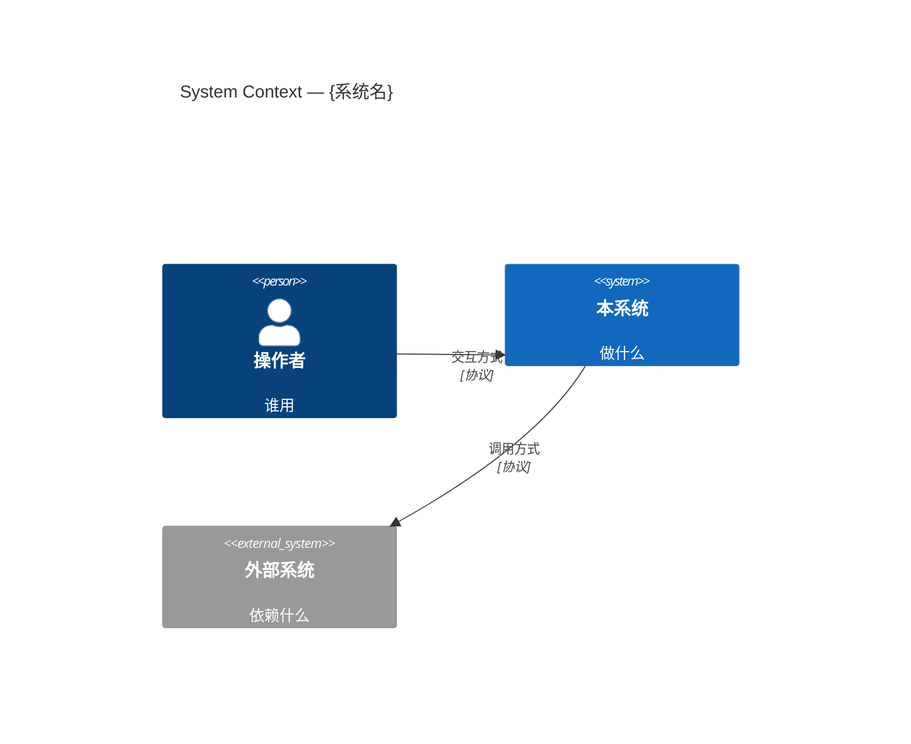
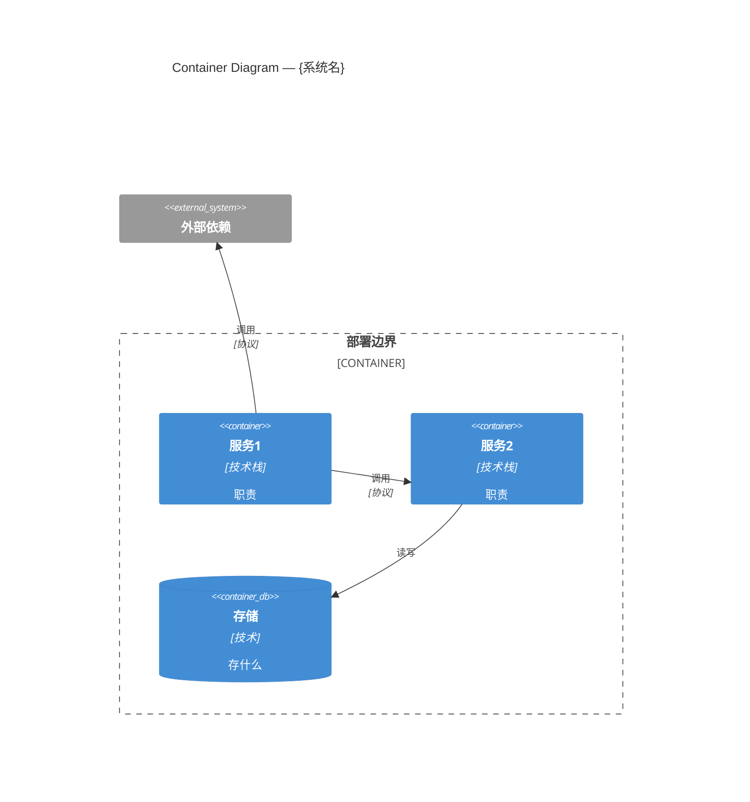
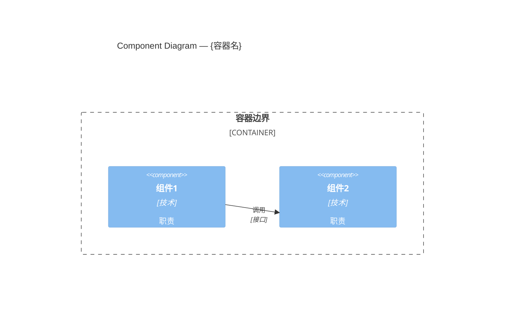

# 架构设计方法论

tech-proposal 阶段④的深度参考。按需读，不常驻。

## 模块拆分原则

三个正交维度，按场景选主维度：

| 维度 | 拆法 | 适用场景 |
|------|------|----------|
| 按变化频率 | 变化快的与稳定的分开 | 长期演进系统 |
| 按职责 | 每个模块只做一件事 | 通用 |
| 按部署单元 | 可独立部署的边界 | 微服务 / 边缘+云 |

**拆分自检**：
- 删掉这个模块，复杂度消失还是扩散到 N 个调用方？（消失=pass-through，扩散=有存在价值）
- 模块接口能否再简化？（方法数、参数复杂度）
- 能否藏更多复杂度在内部？（内部 seam 不暴露）

## 增量设计（已有系统 + 新需求）

不是从零画图，是往已有图里加块。关键动作：

1. **读已有架构**：找 seam（可插入新行为的点）、记录已有模块职责和接口
2. **评估影响范围**：新需求触及哪些模块？改接口还是加接口？
3. **解耦新模块**：新模块通过接口与已有模块交互，不直接依赖已有实现
4. **对齐已有风格**：命名、错误处理、日志、配置方式与已有代码一致

**变更影响矩阵**：

| 变更点 | 影响模块 | 改接口/加接口 | 风险 |
|--------|----------|--------------|------|
| {新增语音输入} | {运动控制、命令分发} | {加接口} | {低} |

## C4 Mermaid 图约定

三层递进，每层聚焦不同读者：

### Context 图（给利益相关者看）



### Container 图（给架构师看）



### Component 图（给开发者看）



**图纪律**：
- 每张图聚焦一个层次，不跨层
- 节点数 ≤15，超过则拆多张图
- 关系标注协议/接口名
- 用 `System_Boundary` / `Container_Boundary` 分组

## 嵌入式 / 机器人专节

### 实时域分离

| 域 | 典型硬件 | 任务 | 延迟要求 |
|----|----------|------|----------|
| 实时域 | FPGA / MCU / RTOS | PWM、编码器、安全联锁 | <100µs |
| 计算域 | Linux-class SoC (Jetson 等) | 感知、规划、推理 | 50-200ms |

**关键规则**：Linux 不进安全链——调度无数学可证明的上界。

### 安全联锁

- 独立安全处理器（watchdog）
- 关节限位、力矩阈值硬编码
- 紧急停机路径不经过计算域

### 验证门（EVT → DVT → PVT）

| 阶段 | 问题 | 验证 |
|------|------|------|
| EVT | 能工作吗？ | 核心架构、最大假设 |
| DVT | 可靠吗？ | 生产意图件、环境测试、EMI/EMC |
| PVT | 能量产吗？ | 良率、周期、质控 |

### 需求三类

- **功能需求**：必须做什么（"AGV 运载 500kg"）
- **性能需求**：做到什么程度（"定位精度 ±2cm"）
- **约束需求**：物理/法规限制（"8 小时续航、ISO 10218"）

## ML 部署专节

### 五平面参考架构

| 平面 | 功能 | 关键工具 |
|------|------|----------|
| 云端训练 | 模型开发、训练、验证 | MLflow / SageMaker / Vertex AI |
| 注册与打包 | ONNX 导出、TRT engine 构建、签名 | Kubeflow / cosign / SLSA |
| 分发 | OTA、分批发布、健康门 | Fleet Command / Mender / balenaCloud |
| 边缘运行时 | 推理执行、特征管线 | Triton / ONNX Runtime / OpenVINO |
| 遥测与监控 | 漂移检测、性能 | OTel / VictoriaMetrics / Grafana |

### 模型转换管线（Jetson / 嵌入式典型）

```
HuggingFace 模型
  → 量化（FP8/INT4/INT8）
  → ONNX 导出（opset 21）
  → TensorRT engine 构建（trtexec / llm_build）
  → C++ 运行时推理
```

### 内存经验值

- VRAM：约 2-3× 模型大小（大多数操作），约 5-6×（FP8 ONNX 导出）
- RAM：约 2-3× 模型大小（大多数操作），约 18-20×（FP8 ONNX 导出）
- 小模型（0.6B-3B）：8-16GB VRAM；大模型（7B-8B）：20-48GB

### OTA 策略必含

1. 声明式目标状态（非命令式推送）
2. 分批发布：canary → cohort → fleet，阶段间健康门
3. A/B 分区回滚：双槽（A 运行、B 候选），watchdog 触发回切
4. 模型签名与验证：cosign keyless OIDC
5. 增量更新：仅传变更部分（蜂窝/卫星链路）
6. 上线前冒烟测试：已知输入验证

## 权衡分析框架（Drawbacks-first）

**先写缺点，再写选择理由**（Rust RFC 实践）。

### 决策表

| 决策点 | 候选 A | 候选 B | 选择 | 理由 |
|--------|--------|--------|------|------|
| {选什么} | **缺点**：… | **缺点**：… | {A/B} | {为什么接受 A 的缺点而非 B 的} |

### 分析步骤

1. 列出每个候选的**缺点**（先于优点——迫使诚实评估）
2. 列出优点
3. 对比：哪个缺点更可接受？
4. 选择 + 写明"为什么接受这个缺点"
5. 记录被拒绝的候选及其关键优点（未来可能反转）

### Non-Goals 判定

Non-Goals 不是否定目标（"系统不应崩溃"），而是**合理但排除的事项**（"v1 不支持多语言"）。判定方法：
- 这个功能**可以合理地**属于本项目吗？
- 如果是，但当前排除 → Non-Goal
- 如果不是 → 不需要提
